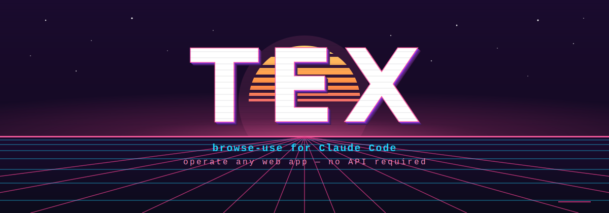

<p align="center">
  
</p>

<p align="center">
  <b>Operate any web app. No API required.</b><br>
  A self-hosted <i>browse-use</i> engine for Claude Code — it drives a real browser to do the things that have no API, MCP, or CLI.
</p>

<p align="center">
  
  =20">
  
  
</p>

---

## What is TEX?

TEX gives Claude Code a hand on the mouse.

Most "agent" tooling stops where the API stops. But the vast majority of software in the real world — internal admin panels, legacy portals, dashboards, SaaS tools that gate everything behind a login — has **no usable API, MCP connector, or CLI**. For everything in that long tail, the only interface is the UI a human would click through.

TEX is the engine that clicks through it. You give it a task in plain language; it opens a real browser, navigates, reads, types, and reports back. It ships as a **Claude Code plugin**: a local engine (Node + Playwright) plus a thin MCP server that hands Claude two tools — **`browse_use`** and **`tex_health`**.

```
You:    "Log into the portal, find this month's invoices, and list the unpaid ones."
TEX:    *opens browser → logs in → navigates → reads the table → reports back*
```

## Why TEX?

- **The long tail has no API.** You can't integrate what nobody exposes. TEX turns "there's no API for that" into "done."
- **Browse-use is becoming the default.** As vision models get cheaper and sharper, driving the UI directly stops being a hack and starts being the general-purpose path. TEX is built for that future — and gets *better the more you use it*.
- **It learns.** Every successful run can be saved as a per-app **skill**, and a proven skill can be **compiled to a $0, no-LLM replay**. The tenth time you do a task, it can be deterministic and free.
- **It's yours.** Self-hosted (Node + a browser), your keys, your machine. No third party in the loop.

## How it works — the fallback ladder

TEX only engages when there's no structured access (API / MCP / CLI / A2A). From there it descends a UI ladder, **cheapest and most reliable first**, escalating only when it has to:

```
   structured (API / MCP / CLI)        ← handled upstream; TEX doesn't run here
   ─────────────────────────────────────────────────────────────────────────
1. compiled-replay   →  learned, no-LLM script. deterministic, $0.
2. browser-use       →  DOM / CDP automation. fast, robust on normal pages.
3. computer-use      →  vision + stealth. the last resort for tough UIs.
```

A **smart router** picks the highest gear it can for the task, and **downshifts on failure** (self-healing). Completion is checked against **verifiable postconditions**, not the model's say-so — so "done" means *done*.

## Quickstart

> **Requirements:** Node.js ≥ 20 · `playwright` Chromium · an LLM key (Anthropic API or AWS Bedrock). Postgres is **optional**.

```bash
# 1. Engine deps + the browser
cd stack && npm install && npx playwright install chromium

# 2. MCP server deps
cd ../mcp && npm install

# 3. Config — copy the template (repo root) and set your provider key
cp .env.example .env        # set LLM_PROVIDER + ANTHROPIC_API_KEY (or AWS creds)

# 4. Start the engine (loads .env, waits for /health, prints status)
scripts/tex-up.sh
```

**Register it with Claude Code** — pick one:

```bash
# a) The whole plugin (tools + the skill that auto-triggers it)
claude --plugin-dir /ABS/PATH/TO/tex

# b) Just the MCP server, available in THIS project
claude mcp add tex-browse-use -- node /ABS/PATH/TO/tex/mcp/server.mjs

# c) Available in EVERY repo, persistently:
claude mcp add --scope user --env TEX_ENGINE_URL=http://127.0.0.1:18802 \
  tex-browse-use -- node /ABS/PATH/TO/tex/mcp/server.mjs
```

Then in Claude Code: run **`tex_health`** to confirm, and ask for a browser task in plain language.

Stop the engine with `scripts/tex-down.sh`. Full setup + troubleshooting in [`INSTALL.md`](./INSTALL.md).

## The tools

| Tool | What it does |
|---|---|
| **`browse_use(task, url?, app?)`** | Run a browser task. `task` = what to do + what to report back; `url` = where to start; `app` = optional name to reuse a saved login session, learned skills, and credentials. Blocks until done, returns the findings + a run summary (gear, steps, tokens, final URL). |
| **`tex_health()`** | Is the engine up, and which tiers (vision / DOM / stealth / compiled replay) are available? |

**Verified end-to-end:** task *"Report the main heading then say AUFGABE ERLEDIGT"* on `https://example.com` → completed in ~7s (gear 1, ~3.4k tokens), returning `The main heading is "Example Domain". AUFGABE ERLEDIGT`. The full path **Claude Code → MCP → engine → Playwright → LLM** works.

## LLM providers

Pick one in `.env` (`LLM_PROVIDER`; auto-detects if unset):

- **`anthropic`** — recommended for local. Set `ANTHROPIC_API_KEY`; model defaults to `claude-sonnet-4-6` (computer-use capable). No AWS needed.
- **`bedrock`** — for EU / data-residency. Set AWS creds + `BEDROCK_MODEL=eu.anthropic.claude-sonnet-4-6`.

The MCP tools are repo-wide, but they all talk to **one** local engine on `:18802` — start it once, it serves every project.

## What's in this repo

```
tex/
├── stack/          the engine — Node/Hono + Playwright, vision/DOM/stealth tiers
│   └── src/        server, agent loops, smart-router, providers, vault, skills, verifier
├── mcp/            the MCP server (server.mjs) — browse_use + tex_health
├── skills/         the browse-use skill (tells Claude when to reach for it)
├── scripts/        tex-up.sh / tex-down.sh
├── .claude-plugin/ plugin manifest
├── .mcp.json       registers the MCP server (${CLAUDE_PLUGIN_ROOT})
└── examples/       example app "manifest" (advanced: declarative per-app flows)
```

Engine runs with **no build step** — `tsx` executes the TypeScript directly. On a Linux server the full stack adds stealth (`:18803`), a DOM gateway (`:18804`), an a11y tier (`:18805`) and `Xvfb`; on macOS the engine + headless Playwright is all you need.

## Status

**Verified:** engine boots on macOS (Node 25 + tsx); Postgres-optional works; the full `MCP → engine → browser → LLM` path verified end-to-end against AWS Bedrock.

**Not yet verified:** the direct Anthropic-API provider is implemented and boots, but hasn't been exercised with a live key — smoke-test it with yours. The Linux-only stealth/gateway tiers weren't run on macOS.

## Security

TEX drives a real browser and can hold logins — read [`SECURITY.md`](./SECURITY.md) before pointing it at anything sensitive. Short version: the engine binds to `127.0.0.1` and is **unauthenticated** (keep it on localhost); credentials are stored AES-256-GCM encrypted and are sent to your LLM provider at run time; this repo ships a clean history with no secrets.

## Credits & license

Released under the [MIT License](./LICENSE).
